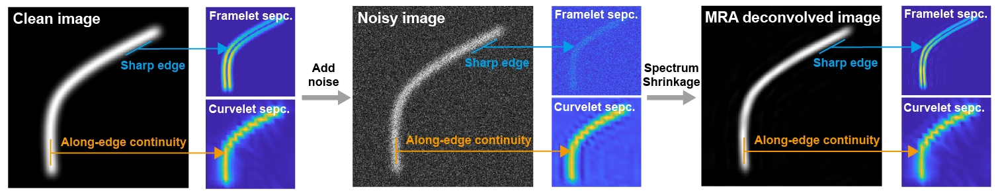
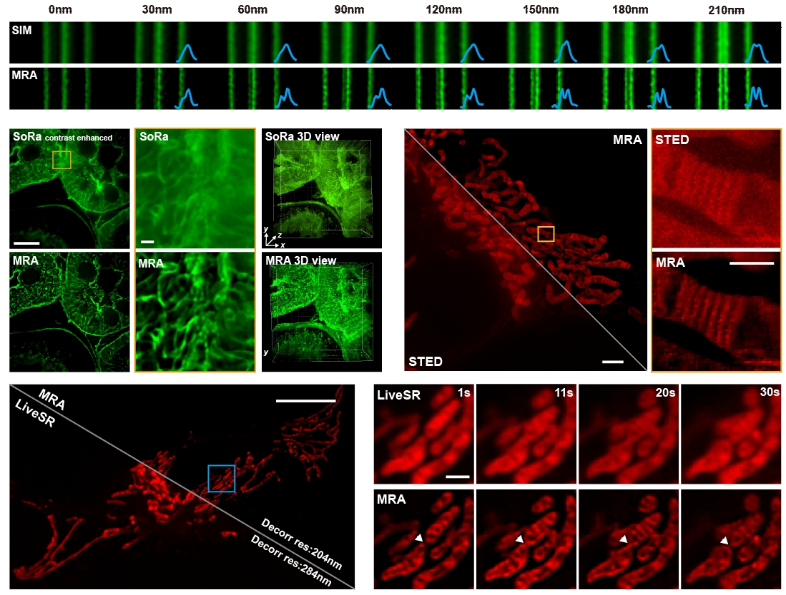

# MRA-SecMRA-deconvolution
Supplementary software and source code for the manuscript "Multi-resolution analysis enables fidelity-ensured deconvolution for fluorescence microscopy".

Currently, the package contains the .m source code and a .exe files containing GUI of the algorithms with one test dataset.

The key innvoation of MRA lies in the utilization of two redudant multiscale bases, framelet and curvelet to extract fluorescence signals from noise, together with an improved energy-based deblurring iteration that avoids the artifact-proness of Richardson-Lucy-based deconvolution.

## 💻 System requirements

MRA&DeepMRA deconvolution package only requires a standard computer.

The software is implemented with MATALB 2020b and tested in Windows 10&11 environments.

# 💿️ Installation guide

The package does not need additional installation steps. 

For biology users: To run the .exe files, the MATLAB software is not necessary but one should download and install the 15 MATLAB runtime version 2020b for compiling from: https://ww2.mathworks.cn/products/compiler/matlab-runtime.html. After the installation, the MRA & DeepMRA deconvolution software can be readily used.

For developers: To run the .m GUI, users need to install MATLAB at any version (this code is written based on MATLAB 2020b, different MATLAB version may have different function rules that influence the functioning). Open the MRA.m or DeepMRA.m file, then click run to activate the software.

# ✨ Demo
Some test data and parameters are attached with the project for demonstration. To access all the raw fluorescence images displayed in the article, please access: https://figshare.com/articles/dataset/Fluorescence_image_zip/24100263

See some representative MRA deconvolution results:

# 🎯 Instructions for use
A detailed UserManual is attached with the project. For any questions in usage, please contact: houyiwei@stu.pku.edu.cn

# 🌐 Citation
If you find our code or data useful, please cite the article: "Multi-resolution analysis enables fidelity-ensured deconvolution for fluorescence microscopy" , published in eLight https://doi.org/10.1186/s43593-024-00073-7.
